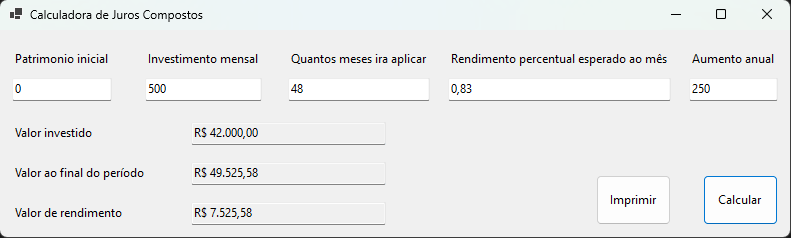

# Calculadora de Juros Compostos

Bem-vindo ao Projeto de Calculadora de Juros Compostos! 

Neste arquivo README, você encontrará informações úteis sobre o funcionamento do projeto.

## Índice

- [Sobre](#sobre)
- [Tecnologias e Frameworks](#tecnologias-e-frameworks)
- [Em funcionamento](#em-funcionamento)
- [Conclusão](#conclusão)

## Sobre

O objetivo desse projeto foi construir uma calculadora simples de juros compostos, utilizando os conhecimentos que eu já tinha em C#, e dar os primeiros passos no desenvolvimento de aplicações com Windows Forms.

Juros compostos são uma forma de cálculo de juros que leva em consideração tanto o valor principal (o montante inicial) quanto os juros acumulados ao longo do tempo.

O funcionamento dos juros compostos é baseado no princípio do "juro sobre juro". Em cada período de tempo, os juros são calculados com base no montante total acumulado até o momento, incluindo os juros acumulados anteriormente. Isso significa que o valor dos juros aumenta a cada período, o que resulta em um crescimento exponencial do investimento ou em um aumento da dívida ao longo do tempo.

O Windows Forms é uma tecnologia de interface gráfica do usuário (GUI) desenvolvida pela Microsoft para criar aplicativos desktop para o sistema operacional Windows. Juntamente com a linguagem de programação C# e o framework .NET, o Windows Forms oferece uma maneira eficiente de construir interfaces de usuário interativas e funcionais.

## Tecnologias e Frameworks 

Neste projeto, foi utilizado as seguintes tecnologias:

- C# 
- .NET 6
- Windows Forms

## Em funcionamento

1. Clone este repositório: `git clone https://github.com/M-LaScala/Calculadora-de-Juros-Compostos`
2. Navegue até o diretório do projeto e abra o arquivo .SLN com o visual studio 2022+
3. Inicie o projeto e verifique o funcionamento.

Exemplo de utilização para calcular juros compostos de forma correta:

## Conclusão

Este projeto teve início no ano de 2022, com o propósito de ser um estudo prático voltado à criação de aplicações utilizando Windows Forms. O objetivo principal é explorar e compreender os conceitos e práticas envolvidos na construção de interfaces gráficas com Windows Forms, combinando meus conhecimentos em C# e .NET.
